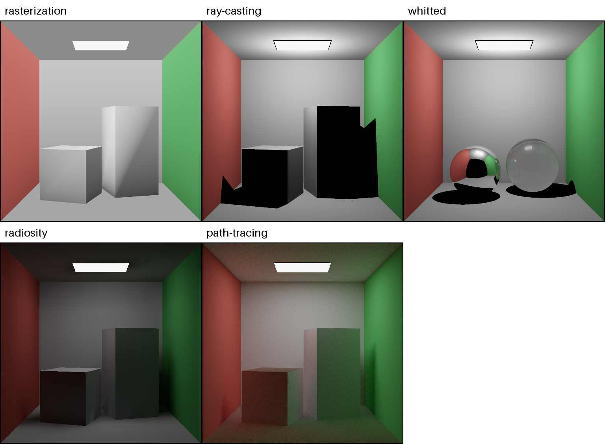
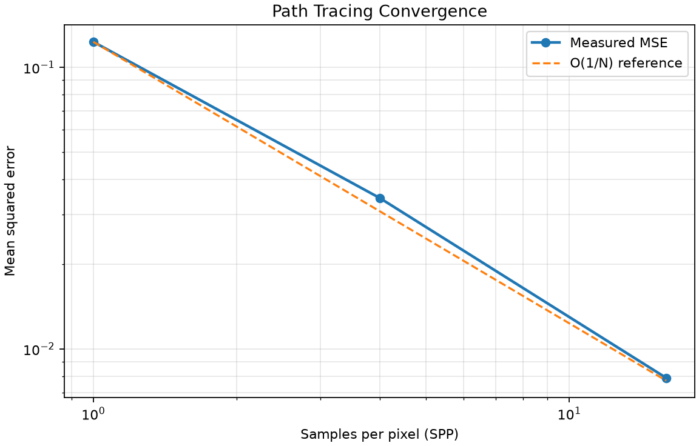

# Homemade CPU Renderer

[简体中文](README.zh-CN.md)

A maintainable, pure-CPU rendering project that compares five rendering methods in a shared Cornell Box. The project treats mathematical and physical validation as first-class output: an image is not considered correct merely because it looks plausible.

## Rendering methods

| Method | Visibility model | Supported light transport | Primary validation |
| --- | --- | --- | --- |
| Rasterization | Triangle projection and Z-buffer | Local direct lighting | Projection and depth ordering |
| Ray Casting | Primary and shadow rays | Direct lighting and hard shadows | Analytic ray intersections |
| Whitted Ray Tracing | Recursive deterministic rays | Direct light, ideal reflection, ideal refraction | Reflection, Snell's law, and bounded throughput |
| Radiosity | Patch-to-patch energy exchange | Diffuse global illumination and color bleeding | Form-factor reciprocity and linear-system residual |
| PBR Path Tracing | Monte Carlo rendering equation | Mixed direct and indirect transport | Energy conservation, white furnace, and MSE convergence |

Rasterization is the non-ray-traced baseline. All five methods use the same scene definitions, camera, linear color pipeline, output encoding, and resource policy wherever their mathematical models permit a fair comparison.

## History, efficiency, and practical use

The table below covers the four deterministic methods. The speed descriptions are algorithmic expectations for this implementation, not invented benchmark numbers. Reproducible wall-clock time, Worker count, Tile count, and quality settings are written to `outputs/reports/*.json` by every real run.

| Method | Historical milestone | Speed and CPU efficiency in this project | Visual result and limitations | Typical applications |
| --- | --- | --- | --- | --- |
| Rasterization | Scan conversion evolved through the 1960s; Edwin Catmull's [1974 dissertation](https://cir.nii.ac.jp/crid/1971149384832865339) is a representative early reference for Z-buffered surface display. | Usually the fastest route. Work is dominated by triangle coverage and visible pixels; independent Tiles scale well across CPU Workers. The default 3×3 antialiasing costs nine deterministic subpixel evaluations but no recursive rays. | Crisp geometry, continuous Gouraud direct-light gradients, and correct depth ordering. It does not produce ray-traced reflection, refraction, indirect light, or physically derived shadows. | Real-time engines, CAD viewports, games, UI previews, and the visibility pass used by modern GPU pipelines. |
| Ray Casting | Arthur Appel published [“Some Techniques for Shading Machine Renderings of Solids”](https://research.ibm.com/publications/some-techniques-for-shading-machine-renderings-of-solids) in 1968. | Fast to medium. Each subpixel launches one primary ray and additional finite-distance shadow tests. Pixels and Tiles are independent, so process-level parallelism is efficient; cost grows with pixels, samples, lights, and intersected triangles. | Exact primary visibility, direct Lambert lighting, and hard shadows. Surfaces outside direct illumination remain black because this method deliberately has no indirect bounce. | Picking and visibility queries, scientific volume rendering variants, simple offline previews, shadow tests, and a baseline for acceleration structures. |
| Whitted Ray Tracing | Turner Whitted introduced recursive reflection/refraction at SIGGRAPH [1979](https://doi.org/10.1145/800249.807419); the expanded CACM article appeared in [1980](https://doi.org/10.1145/358876.358882). | Medium to slow. Tiles parallelize well, but mirror and dielectric hits recursively create more rays. Runtime depends strongly on recursion depth, reflective geometry, antialiasing, and intersection cost. Smooth subdivision-3 spheres improve quality without changing the light-transport model. | Clean ideal mirror reflection, glass refraction, Fresnel edges, direct light, and hard shadows. It cannot reproduce rough glossy transport or diffuse indirect color bleeding. | Product visualization with ideal glass or mirrors, optical demonstrations, classic offline renderers, education, and deterministic reference scenes. |
| Radiosity | Cindy Goral, Kenneth Torrance, Donald Greenberg, and Bennett Battaile introduced the graphics method and original Cornell Box result at [SIGGRAPH 1984](https://bowers.cornell.edu/cornell-box). | Expensive preprocessing: pairwise Patch coupling is approximately quadratic in Patch count, while the current dense linear solve can approach cubic cost and is intentionally global rather than Tile-parallel. Once solved, the view-independent lighting can be reused for multiple cameras. | Stable diffuse global illumination, soft energy transfer, and red/green color bleeding. Subdivision-3 Patches plus material-safe vertex interpolation suppress visible triangular blocks. It does not model mirrors or glass. | Architectural lighting, diffuse indoor scenes, lightmap baking, static visualization, and validation of energy exchange between surfaces. |

Path Tracing is the stochastic fifth method: it is slower but supports the broadest light-transport space. Its quality is controlled separately by Monte Carlo SPP, and the deterministic 3×3 setting above never multiplies its path count.

### Measured 512×512 production run

These are real wall-clock results from the committed reports, not estimates. The four image-space methods used 21 Worker processes; Radiosity performed its required global solve in one process. Path Tracing used 128 SPP. The five main images took 1,045.96 seconds in total, or approximately 17 minutes 26 seconds. Convergence and white-furnace validation time is excluded.

| Method | Time | Relative to Rasterization |
| --- | ---: | ---: |
| Rasterization | 2.74 s | 1.0× |
| Ray Casting | 11.15 s | 4.1× |
| Whitted Ray Tracing | 253.61 s | 92.5× |
| Radiosity | 22.51 s | 8.2× |
| Path Tracing | 755.95 s | 275.9× |

## Why a Cornell Box?

The Cornell Box keeps the geometry understandable while exposing the differences that matter:

- hard visibility and depth ordering;
- direct illumination and shadows;
- ideal mirror reflection and dielectric refraction;
- diffuse interreflection and red/green color bleeding;
- stochastic convergence under increasing samples per pixel (SPP).

The canonical scene is generated programmatically so the core project remains reproducible offline. Optional reference assets may be downloaded separately with recorded provenance, licensing, and SHA-256 checksums.

## Correctness before appearance

The project validates production implementations directly. It does not use mock renderers, hard-coded result images, test-only algorithms, or alternate “quick validation” paths.

The final result set will preserve:

- rendered images for all five methods;
- a labeled five-method comparison;
- Path Tracing results at multiple SPP levels;
- MSE and standard-error convergence charts;
- white-furnace and energy-conservation reports;
- Radiosity form-factor and solver-residual reports;
- CPU, worker-count, memory, seed, and timing metadata.

Validated results are stored under `outputs/` and committed to the repository. README figures are derived from those real outputs rather than handcrafted illustrations.

## CPU resource policy

Rendering uses process-level parallelism. By default, the worker count is computed as approximately 90% of the visible logical CPUs while retaining at least one logical CPU for the operating system on multicore machines.

Each worker limits BLAS, NumExpr, Numba, and related numerical backends to avoid nested thread oversubscription. The reported “90%” is a capacity policy based on logical CPU count, not a promise that an operating-system monitor will remain at exactly 90% utilization every instant.

The terminal shows two tqdm progress levels: the overall five-method completion and the active method's completed Tiles or Radiosity Patches. Standard tqdm output includes elapsed time, processing rate, and ETA.

## Installation

Python 3.11 or newer is required.

```bash
python3 -m venv .venv
source .venv/bin/activate
python3 -m pip install -e '.[dev]'
```

The optional Embree-compatible CPU intersection backend can be installed with:

```bash
python3 -m pip install -e '.[dev,embree]'
```

## Run

The default preset is 512×512, with 128 SPP for the main Path Tracing result, a 1024 SPP convergence reference, 32×32 multiprocessing Tiles, and approximately 90% of logical CPUs. The other methods use 3×3 deterministic antialiasing, smooth subdivision-3 Whitted spheres, and subdivision-3 Radiosity with material-safe vertex interpolation. These controls do not increase Path Tracing's sample count. Generate every README result with one command:

```bash
./run.sh
```

The command runs the five production renderers, convergence experiment, energy validation, white-furnace test, comparison montage, and README image publication. Parameters live in [`params/default.toml`](params/default.toml).

Run one method with the same default preset:

```bash
./run.sh rasterization
./run.sh ray-casting
./run.sh whitted
./run.sh radiosity
./run.sh path-tracing
```

Explicit arguments select a custom run, for example `./run.sh path-tracing --width 256 --height 256 --spp 64`.

## Rendered results

The figures below are generated by the production implementations and copied from the tracked `outputs/` evidence. Running `./run.sh` refreshes them.






To inspect the CPU allocation without rendering:

```bash
./run.sh system-info
```

## Architecture

```text
src/renderer/
├── core/          # Rays, color transforms, and shared numerical contracts
├── geometry/      # Mesh adapters, projection, and intersection backends
├── materials/     # Diffuse, mirror, and dielectric material contracts
├── lights/        # Point and area emitters
├── scenes/        # Shared Cornell Box and white-furnace scenes
├── methods/       # Five independent rendering algorithms
├── parallel/      # Worker policy, thread limits, tiles, and deterministic seeds
├── validation/    # Geometry, energy, radiosity, furnace, and convergence checks
└── output/        # PNG encoding, charts, montages, and run metadata
```

The architecture follows SOLID and DRY principles without forcing mathematically different algorithms into a misleading common implementation. Shared scene, geometry, color, resource, output, and validation rules have one source of truth; each method retains its genuinely distinct rendering logic.

## Documentation and code quality

Every project-owned code file begins with a Chinese module-intent description. Functions, methods, and classes include Chinese documentation covering parameters, return values, exceptions, side effects, units, coordinate systems, and relevant preconditions. Complex formulas, numerical tolerances, energy weights, random sampling, and multiprocessing boundaries include nearby Chinese rationale.

The governing requirements and planned file ownership are available in:

- [`specs/PRD.md`](specs/PRD.md)
- [`specs/PROJECT_TREE.md`](specs/PROJECT_TREE.md)

## Tests

Run the production contract tests with:

```bash
PYTHONPATH=src python3 -m pytest -p no:cacheprovider tests
```

The tests cover production configuration, geometry, optics, energy conservation, all five renderers, multiprocessing, output files, and deterministic sampling.
